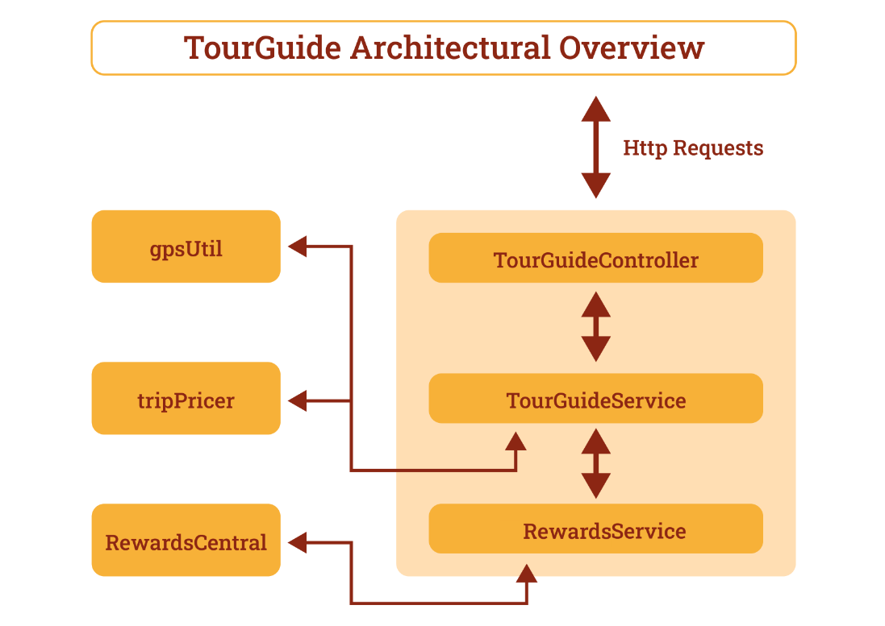

# TourGuide

L’application TourGuide est une application Spring Boot qui permet de faciliter la planification de voyages.
Elle s’adresse principalement aux voyageurs et touristes recherchant des offres groupées pour découvrir facilement des attractions locales tout en économisant sur l’hébergement et les loisirs.
De plus, grâce à son système de recommandations personnalisées et de réductions, TourGuide permet aux partenaires commerciaux (hôtels, attractions) d’augmenter leur visibilité et leur taux de réservation auprès d’un large public.

## 🛠️ Technologies

- **Langage :** Java 17
- **Framework :** Spring Boot
- **Build Tool :** Maven
- **Tests unitaires :** JUnit 5 et Mockito

## 🎯 Objectifs du projet

L’objectif de ce projet est l’amélioration de l’application Tourguide face à la croissance explosive du nombre d’utilisateurs, en :
- corrigeant les bugs qui font échouer les tests unitaires
- ajoutant une fonctionnalité de recommandation de destinations
- améliorant les performances de l’application, car elle est trop lente pour réaliser certaines actions
- en ajoutant un pipeline d’intégration continue.

## 🚫 Hors du champ d’application

Les objectifs suivants ne sont pas couverts par ce projet :

🔒 **Sécurité :** aucune authentification ou gestion des droits n’a été mise en place.

🌍 **Persistance des données :** le projet fonctionne entièrement en mémoire, sans base de données.

📱 **Interface utilisateur :** aucune interface graphique n’est prévue ; seules des API REST sont exposées.

🧪 **Simulation de trafic réel :** bien que des tests de performance aient été réalisés, l’application n’est pas testée avec un trafic utilisateur concurrent réel (via HTTP).

☁️ **Déploiement :** le projet n’est pas configuré pour un déploiement cloud ou distribué, aucune conteneurisation ni infrastructure cloud n’a été mise en place.

⏳ **Tracking en temps réel :** la géolocalisation des utilisateurs s'effectue uniquement via des appels ponctuels.

## 🗺️ Schéma de conception technique



**Légende :**

**TourGuideController:** point d'entrée principal de l'API REST, ce contrôleur expose les endpoints permettant de récupérer la position d’un utilisateur, les attractions touristiques proches, les récompenses obtenues et des offres de voyage personnalisées.

**TourGuideService:** service central de l'application, il orchestre la récupération des localisations des utilisateurs, le calcul des récompenses, la recherche des attractions proches et la génération des offres de voyage en interagissant avec les services gpsUtil, RewardsService et tripPricer.

**RewardsService:** gère l’attribution des récompenses en identifiant les attractions proches des lieux visités par l’utilisateur, en calculant la distance et les points de fidélité associés via l’API RewardsCentral.

**GpsUtil:** fournit des emplacements simulés pour les utilisateurs et une liste prédéfinie d’attractions touristiques, avec un contrôle de débit simulant un service externe.

**TripPricer:** simule un moteur de tarification de voyages en générant dynamiquement une liste d'offres de prestataires avec des prix calculés à partir des préférences utilisateur et de leurs points de récompense.

**RewardsCentral:** simule un service externe attribuant un nombre aléatoire de points de récompense à un utilisateur pour une attraction donnée.

## ⚙️ Installation et lancement

1. **Cloner le dépôt :**

    ```bash
    git clone git@github.com:MarionLz/OC_P8_TourGuide.git
    cd OC_P8_TourGuide

2. **Installer les dépendances :**

    ```bash
   mvn install:install-file -Dfile="libs/gpsUtil.jar" -DgroupId=gpsUtil -DartifactId=gpsUtil -Dversion="1.0.0" -Dpackaging=jar -DlocalRepositoryPath=lib-repo
   mvn install:install-file -Dfile="libs/RewardCentral.jar" -DgroupId=rewardCentral -DartifactId=rewardCentral -Dversion="1.0.0" -Dpackaging=jar -DlocalRepositoryPath=lib-repo
   mvn install:install-file -Dfile="libs/TripPricer.jar" -DgroupId=tripPricer -DartifactId=tripPricer -Dversion="1.0.0" -Dpackaging=jar -DlocalRepositoryPath=lib-repo

3. **Lancer l’application :**

    ```bash
    mvn spring-boot:run